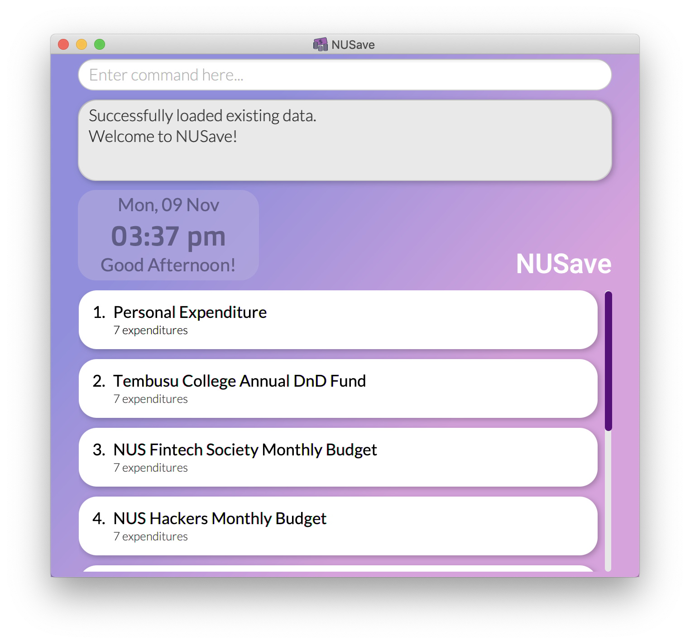

* This is **a sample project for Software Engineering (SE) students**. 
  Example usages:
  * as a starting point of a course project (as opposed to writing everything from scratch)
  * as a case study
* The project simulates an ongoing software project for a desktop application (called _NUSave_) used for managing budgets.
  * It is **written in OOP fashion**. It provides a **reasonably well-written** code base **bigger** (around 6 KLoC) than what students usually write in beginner-level SE modules, without being overwhelmingly big.
  * It comes with a **reasonable level of user and developer documentation**.
* It is named `NUSave`.
* For the detailed documentation of this project, see the **[NUSave Product Website](https://ay2021s1-cs2103t-t11-4.github.io/tp/)**.
* This project is a **part of the se-education.org** initiative. If you would like to contribute code to this project, see [se-education.org](https://se-education.org#https://se-education.org/#contributing) for more info.
