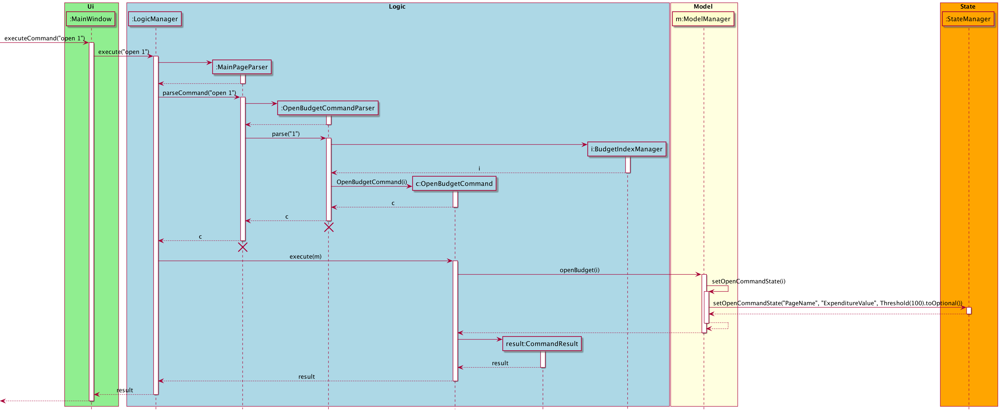
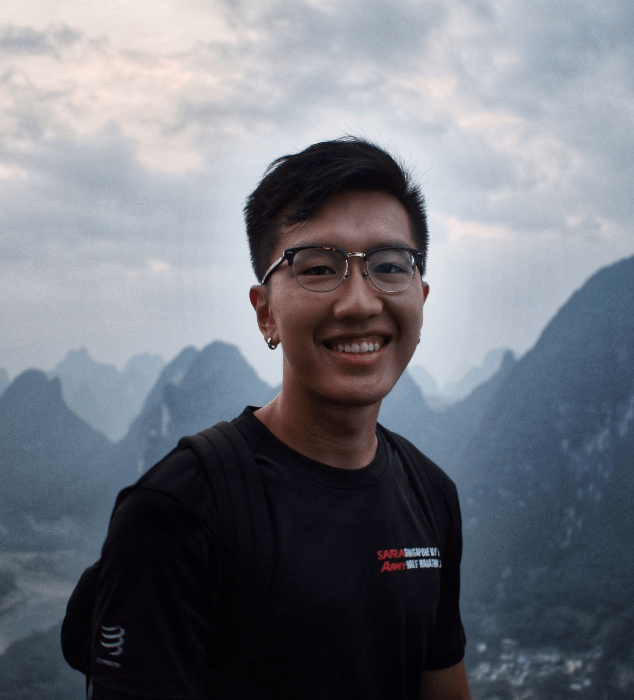

# About Us

We are a team based in the [School of Computing, National University of Singapore](http://www.comp.nus.edu.sg).

## Project team

### Wen Hao

[[github](https://github.com/wenhaogoh)]
[[portfolio](team/johndoe.md)]

* Role: Team Lead
* Responsibilities: Database

### Yu Ming

[[github](http://github.com/yu-ming-chen)]
[[portfolio](team/johndoe.md)]

* Role: Developer
* Responsibilities: Code Quality + Integration

### Ek Chin Hui

[[github](http://github.com/EkChinHui)]

* Role: Developer
* Responsibilities: Database

### Chew Song Yu

[[github](http://github.com/sogggy)]
[[portfolio](team/johndoe.md)]

* Role: Developer
* Responsibilities: Testing

### David

[[github](https://github.com/davidliew9)]
[[portfolio](team/johndoe.md)]

* Role: Developer
* Responsibilities: Documentation
