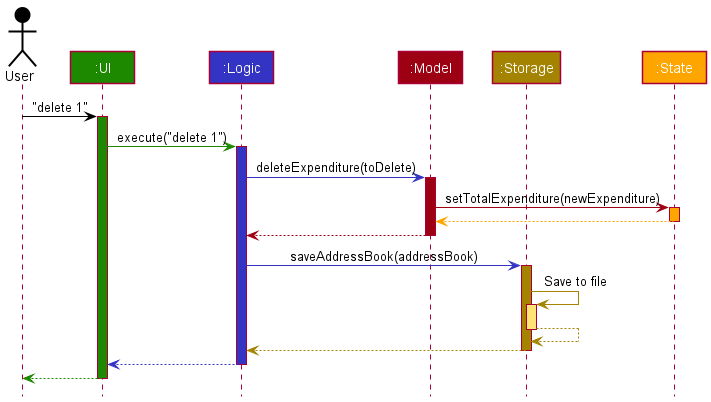
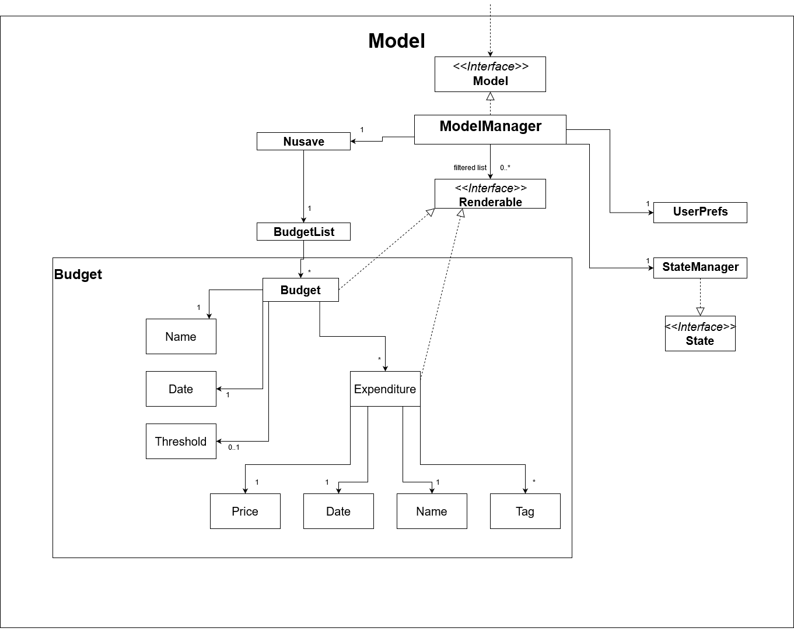
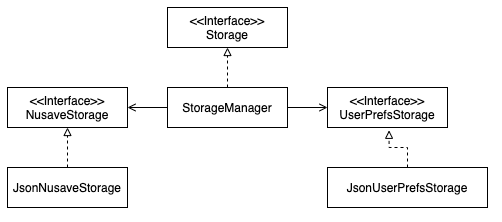

# Developer Guide

## Table of Contents
- [1. Introduction](#1-introduction)
- [2. Setting Up](#2-setting-up)
- [3. Design](#3-design)
    * [3.1. Architecture](#31-architecture)
    * [3.2. UI Component](#32-ui-component)
    * [3.3. Logic Component](#33-logic-component)
    * [3.4. Model Component](#34-model-component)
    * [3.5. State Component](#35-state-component)
    * [3.6. Storage Component](#36-storage-component)  
- [4. Implementation](#4-implementation)
- [5. Documentation](#5-documentation)
- [6. Testing](#6-testing)
- [7. Dev Ops](#7-dev-ops)

## 1. Introduction
NUSave is a budgeting tool made for **students staying on campus** who want to be able to track and manage their own
expenditures with ease. As students, it is common for them to have limited income during their academic years.
Therefore, it is especially necessary for those living independently to plan their finances prudently to ensure that
they do not overspend their tight budget.

A typical student staying on campus has to keep track of: 
* daily expenses
* club finances
* project budgets
* administrative fees

Rather than having multiple documents and spreadsheets to keep track of their budgets, NUSave allows students to
conveniently manage all their expenditures under one centralised platform.

NUSave implements both **Command Line Interface (CLI)** and **Graphical User Interface (GUI)**.
In other words, users interact with the application through the command line and the GUI will reflect their actions.

## 2. Setting Up
Refer to the guide [_Setting up and getting started_](SettingUp.md).

## 3. Design

### 3.1. Architecture

The ***Architecture Diagram*** given above explains the high-level design of the application.

Given below is a quick overview of each component:

**`Main`** has two classes called [`Main`] and [`MainApp`].
It has two primary responsibilities:
* At launch: Initializes the components in the correct sequence, and connects them up with each other.
* At shut down: Shuts down the components and invokes cleanup methods where necessary.

[**`Commons`**](#common-classes) represents a collection of classes used by multiple other components.

The rest of the application consists of five components:

1. [**`UI`**](#ui-component): Handles the UI of the application.
1. [**`Logic`**](#logic-component): Executes the commands.
1. [**`Model`**](#model-component): Holds the data of the application in memory.
1. [**`Storage`**](#storage-component): Reads data from, and writes data to, the hard disk.
1. [**`State`**](#state-componenet): Remembers the current state of the application.

For each of the five components:

* Its API is defined in an `interface` with the same name as the Component.
* Its functionality is exposed using a concrete `{Component Name} Manager` class which implements the corresponding API
`interface` mentioned in the previous point.
    - For example, the `Logic` component defines its API in the `Logic.java` interface and exposes its functionality
    using the`LogicManager.java` class which implements the `Logic` interface.

The ***Class Diagram*** given above shows how the five components interact with each other.

The ***Sequence Diagram*** given above shows how the components interact with each other for the scenario where the user
issues the command `delete 1`.

The sections below give more details of each component:

### 3.2. UI Component

**API**: `Ui.java`

The UI consists of a `MainWindow` that is made up of parts e.g.`CommandBox`, `ResultDisplay`,
`StatusBarFooter` etc. All these, including the `MainWindow`, inherit from the abstract `UiPart` class.

The `UI` component uses JavaFx UI framework. The layout of these UI parts are defined in matching `.fxml` files that are in the `src/main/resources/view` folder. For example, the layout of the `MainWindow` is specified in `MainWindow.fxml`

The `UI` component:

* Executes user commands using the `Logic` component.
* Listens for changes to `Model` data so that the UI can be updated with the modified data.

### 3.3. Logic Component

**API**: `Logic.java`

`Logic` uses the `PageParser` class to parse the user command. This results in a `Command` object which is
executed by the `LogicManager`. The command execution can affect the `Model` (e.g. adding an expenditure). The result of
the command execution is encapsulated as a `CommandResult` object which is passed back to the `Ui`. In addition, the
`CommandResult` object can also instruct the `Ui` to perform certain actions, such as displaying help to the user.

The ***Sequence Diagram*** given above represents the interactions within the `Logic` component for the
`execute("delete 1")` API call.

### 3.4. Model Component

**API** : `Model.java`

The `Model`:

* Stores a `UserPref` object that represents the user’s preferences.
* Stores the budget data.
* Exposes an unmodifiable `ObservableList<Expenditure>` that can be 'observed' e.g. the UI can be bound to this list so
that the UI automatically updates when the data in the list change.
* Does not depend on any of the other three components.

### 3.5. State Component
_{To Be Added}_

### 3.6. Storage Component

**API** : `Storage.java`

The `Storage` component:
* Can save `UserPref` objects in json format and read it back.
* Can also can save the budget data in json format and read it back.

### Common Classes
Classes used by multiple components are in the `seedu.addressbook.commons` package.

## 4. Implementation
_{To Be Added}_

## 5. Documentation
* [Documentation guide](Documentation.md)

## 6. Testing
* [Testing guide](Testing.md)

## 7. Dev Ops
* [DevOps guide](DevOps.md)

## Appendix
**Target User Profile:**

* students staying on campus
* has a need to manage a significant number of budgets and expenditures
* prefers using desktop over other platforms
* types fast and prefers typing to mouse interactions
* is comfortable using CLI applications

**Value Proposition:** 

* manages expenditures faster than a typical mouse/GUI driven application
* allows users to keep track of their budgets on a centralised platform

### User Stories
Priorities: 
* High (must have) - `* * *` 
* Medium (nice to have) - `* *`
* Low (unlikely to have) - `*`

| Priority | As a …​                                 | I want to …​                | So that I can…​                                                     |
| -------- | ------------------------------------------ | ------------------------------ | ---------------------------------------------------------------------- |
| `* * *`  | new user                                   | see a list of available commands | refer to instructions when I forget how to use the application       |
| `* * *`  | user                                       | create a budget                | add a new budget that I need                                           |
| `* * *`  | user                                       | delete a budget                | remove a budget that I no longer need                                  |
| `* * *`  | user                                       | open a budget                  | view the expenditures of a budget                                      |
| `* * *`  | user                                       | close a budget                 | return to the main window                                              |
| `* * *`  | user                                       | add an expenditure             | add a new expenditure to a budget                                      |
| `* * *`  | user                                       | delete an expenditure          | remove an expenditure that I no longer need                            |
| `* *`    | user                                       | find an expenditure by name    | locate an expenditure easily                                           |

### Non-Functional Requirements
1.  Should work on any _mainstream OS_ as long as it has Java `11` or above installed.
2.  Should be able to hold up to 1000 budgets and expenditures without a noticeable sluggishness in performance for typical usage.
3.  A user with above average typing speed for regular English text (i.e. not code, not system admin commands) should be able to accomplish most of the tasks at a fast speed.

### Glossary
* **API**: Application Programming Interface
* **Mainstream OS**: Windows, Linux, Unix, OS-X

## Appendix: Instructions for manual testing
Given below are instructions to test the application manually:

### Launch and Shutdown
1. Launching the application

   1. Download the jar file and copy into an empty folder.

   1. Double-click the jar file. 
   Expected: Shows the GUI with a set of sample budgets. The window size may not be optimum.

1. Saving window preferences

   1. Resize the window to an optimum size. Move the window to a different location. Close the window.

   1. Re-launch the application by double-clicking the jar file. 
   Expected: The most recent window size and location is retained.

### Deletion
1. Deleting a budget

   1. Prerequisites: User is in the main page. Multiple budgets are in the list.

   1. Test case: `delete 1` 
      Expected: First budget is deleted from the list. Details of the deleted budget is shown in the status message.
      Timestamp in the status bar is updated.

   1. Test case: `delete 0` 
      Expected: No budget is deleted. Error details shown in the status message. Status bar remains the same.

   1. Other incorrect delete commands to try: `delete`, `delete x`, `...` (where x is larger than the list size) 
      Expected: Similar to previous.