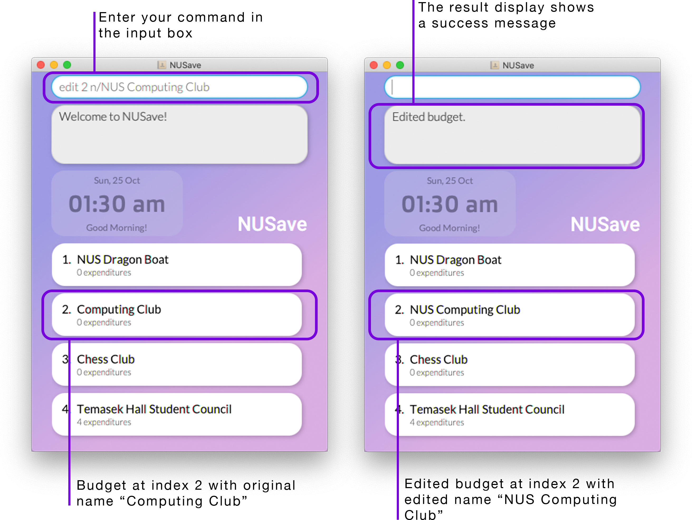
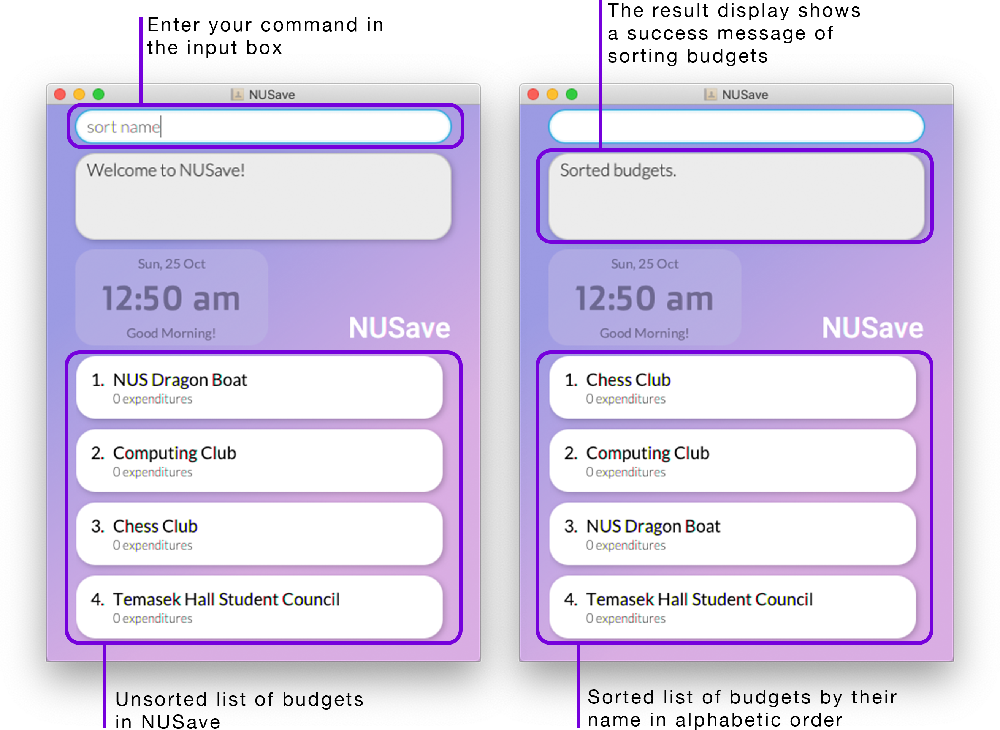
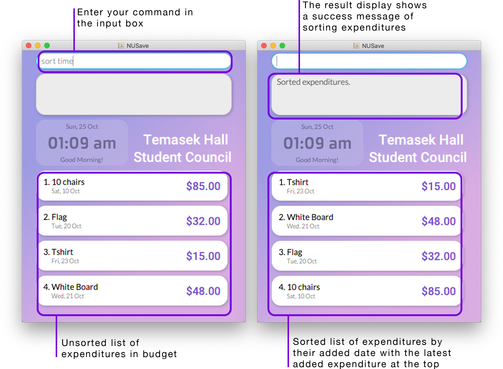

# User Guide
## Table of Contents
1. [Introduction](#1-introduction)
    - [1.1. Purpose of document](#11-purpose-of-document)
2. [About the user guide](#2-about-the-user-guide)
    - [2.1. Symbols](#21-symbols)
    - [2.2. Format](#22-format)
    - [2.3. Parameters](#23-parameters)
3. [Layout](#3-layout)
    - [3.1. Main page view](#31-main-page-view)
    - [3.2. Budget page view](#32-budget-page-view)
4. [Quick start](#4-quick-start)
5. [Tips](#5-tips)
    - [5.1. Syntax highlighting](#51-syntax-highlighting)
6. [Commands](#6-commands)
    - [6.1. Navigation](#61-navigation)
        * [6.1.1. Opening a budget: `open`](#611-opening-a-budget-open)
        * [6.1.2. Closing a budget:`close`](#612-closing-a-budget-close)
        * [6.1.3. Exit NUSave: `exit`](#613-exit-nusave-exit)
        * [6.1.4. View help: `help`](#614-view-help-help)   
    - [6.2. Main page commands](#62-main-page-commands)
        * [6.2.1. Creating a budget: `create`](#621-creating-a-budget-create)
        * [6.2.2. Deleting a budget: `delete`](#622-deleting-a-budget-delete)
        * [6.2.3. Editing a budget: `edit`](#623-editing-a-budget-edit)
        * [6.2.4. Finding budgets: `find`](#624-finding-budgets-find)
        * [6.2.5. Listing budgets: `list`](#625-listing-budgets-list)
        * [6.2.6. Sorting budgets: `sort`](#626-sorting-budgets-sort)
        * [6.2.7. Clearing budgets: `clear`](#627-clearing-budgets-clear)
    - [6.3. Budget page commands](#63-budget-page-commands)
        * [6.3.1. Adding an expenditure: `add`](#631-adding-an-expenditure-add)
        * [6.3.2. Deleting an expenditure: `delete`](#632-deleting-an-expenditure-delete)
        * [6.3.3. Editing an expenditure: `edit`](#633-editing-an-expenditure-edit)
        * [6.3.4. Finding expenditures: `find`](#634-finding-expenditures-find)
        * [6.3.5. Listing expenditures: `list`](#635-listing-expenditures-list)
        * [6.3.6. Sorting expenditures: `sort`](#636-sorting-expenditures-sort)
7. [Command summary](#7-command-summary)
    - [7.1. Navigation](#71-navigation)
    - [7.2. Main page commands](#72-main-page-commands)
    - [7.3. Budget page commands](#73-budget-page-commands)
8. [Glossary](#8-glossary)
9. [FAQ](#9-faq) 

## 1. Introduction
(Contributed by Wen Hao)

Are you a **university student who stays on campus** and has difficulty managing your expenses?

Are you tired of having to look through countless spreadsheets and memos just to figure out how much you have spent this month?

Do you wish there exists a desktop application that can help you organise, track and manage all of your expenses?

Look no further because NUSave is just the tool for you!

Built by 5 university students staying on campus, we understand the difficulties of having to manage multiple budgets,
be it for your daily expenses, school projects or club activities, amidst your busy schedule. NUSave aims to help alleviate
the hassle that comes along with managing multiple budgets by providing a **one-stop solution** to all your problems. It has
features that will help streamline the process of organising your **budgets** and **expenditures**, as well as generate
statistics that can offer you useful insights regarding your spending habits.

What's more, NUSave has:
- a **Command Line Interface (CLI)** catered to those who can type fast and prefer to use a keyboard.
- a **Graphical User Interface (GUI)** to provide you with a visually appealing and aesthetic user experience.

### 1.1. Purpose of document
The purpose of this document is to provide a detailed reference for you to learn how to use NUSave to its fullest potential.

## 2. About the user guide
### 2.1. Symbols
(Contributed by Yu Ming)

Symbols | Meaning 
-------| ------------ 
⚠️ | This sybmol indicates that there is something important for you to take note of.
📕 | This symbol indicates that there is additional information you may find useful.
✏️ | This symbol indicates that an example is provided.
❗| This symbol indicates that the parameter is required.
❕| This symbol indicates that the parameter is optional.

### 2.2. Format
(Contributed by Yu Ming)

This section shows the format of all the commands in the user guide.

Format | Meaning | Exmaple 
-------| ------------ | ----
`lower_case/` | **Prefixes** | `n/` `p/` `t/`
`UPPER_CASE` | **Parameters** | `NAME` `THRESHOLD` `PRICE`
`[UPPER_CASE]` | **Optional parameters** | `[p/THRESHOLD]` in create budget command

> ⚠️ Prefixes **cannot have spaces**: `n /` will be an invalid prefix.
>
> 📕 Parameters can be in **any order** if they have **prefixes**.

For example, a create budget command can have `n/NAME` and `p/THRESHOLD`, you can specify them in any order:
 - `create n/Temasek Hall Student Council p/1200`, or
 - `create p/1200 n/Temasek Hall Student Council`
 
However, if a given command has any parameter **without prefix**, that given parameter **must** be the **first parameter**.

For example, a edit budget command have an `INDEX`, a `n/NAME` and a `p/THRESHOLD`. In this case, `INDEX` **must** be
the **first parameter**:
 - `edit 1 n/NUS Computing Club p/1000` is a valid command, however
 - `edit n/NUS Computing Club p/1000 1` is an invalid command

### 2.3. Parameters
(Contributed by Yu Ming)

Parameter | Meaning 
-------| ------------
`INDEX` | This is the index to be executed on for any given command.
`NAME` | This can be either **name of budget** or **name of expenditure** or **name to find**.
`PRICE` | This is the price of the expenditure.
`THRESHOLD` | This is the threshold of the budget.
`TAG` | This is the tag for the expenditure.
`TYPE` | This is the sorting types.

## 3. Layout
(Contributed by Wen Hao)
### 3.1. Main page view

### 3.2. Budget page view

## 4. Quick start
(Contributed by Wen Hao)

1. Ensure that you have Java `11` or above installed in your Computer.

2. Download the latest `NUSave.jar` from [here](https://github.com/AY2021S1-CS2103T-T11-4/tp/releases).

3. Copy the file to the folder you want to use as the *home folder* for NUSave.

4. Double-click the file to start the application. A GUI similar to Figure 3.1 should appear in a few seconds.


Figure 4.1. Example of how NUSave's GUI looks like.

> 📕 If the application does not start after double-clicking the file, you can troubleshoot by doing the following:
>
> For Windows users:
> 1. Launch command prompt and navigate to the path of the home folder for NUSave.
> 2. Enter the following command: `java -jar nusave.java`
>
> 
>
> Figure 4.2. Example of launching NUSave using command prompt.
>
> For MacOS users:
> 1. Launch terminal and navigate to the path of the home folder for NUSave.
> 2. Enter the following command: `java -jar nusave.java`
>
> 
>
> Figure 4.3. Example of launching NUSave using terminal.

5. Congratulations, you have successfully launched NUSave!
> 📕 If you are launching the application for the first time, a set of sample data will be created for you.
> Use the [clear command](#627-clearing-budgets-clear) to purge the existing sample data.

6. Type your desired command in the command box and press enter to execute it. Below is a series of commands that you can try:
    - `help`: Shows the list of commands currently available.
    - `exit`: Exits the app.

7. Refer to the [commands](#6-commands) below for details of each command.

## 5. Tips
### 5.1. Syntax highlighting

## 6. Commands
### 6.1. Navigation
#### 6.1.1. Opening a budget: `open`

#### 6.1.2. Closing a budget: `close`

#### 6.1.3. Exit NUSave: `exit`
(Contributed by David)

You can use this command to **exit from the application**.

When exiting NUSave, all changes made to the application will be saved.

>📕 You can use this command at any point of time.

Format: `exit`

✏️ Example
`exit`

This will exit the application. When the application is launched again, the change you made will remain.


Figure 6.2.1.1. Example of using the exit command on both the main page and budget page.

#### 6.1.4. View help: `help`
(Contributed by Yu Ming)

You can use this command to **view a list of available commands**.

The help will be displayed in the results window, and it will contain a list of all available commands and their
required syntax.

>📕 You can use this command at any point of time.

✏️ Example:

`help`

This will display the help instructions in the results window.


Figure 6.1.4.1. Example of help command

### 6.2. Main page commands
#### 6.2.1. Creating a budget: `create`
(Contributed by Yu Ming)

You can use this command to **create a new budget**.

When a new budget is created it will be stored inside NUSave, and it will be reflected immediately in the list of budget
on the main page of NUSave. This command is only available when no budget is open.

 > ⚠️ Upon first launch, **you may notice NUSave main page is empty**. This is because there are no budgets created yet. Go
 > ahead and create a budget to see NUSave get populated with your entries!

Format: `create n/NAME [p/THRESHOLD]`

Prefix | Parameters | Requirement | Comments
-------| ------------ | ------------- | ------
 n/ | NAME | ❗Required | Name of the budget
 p/ | THRESHOLD | ❕Optional | Target maximum capacity of the budget

✏️ Example:

`create n/Temasek Hall Student Council p/1200`

This will create a new budget called "Temasek Hall Student Council" with a threshold value of $1200.


Figure 6.2.1.1. Example of create budget command

#### 6.2.2. Deleting a budget: `delete`
(Contributed by David)

You can use this command to **delete an existing budget**.

When a budget is deleted it will be removed from NUSave, and the 
deletion will be reflected immediately in the list of budget on the main page of NUSave.

 > ⚠️ **You cannot use this command if main page is empty**. This is because there are no budgets created yet. 
 > You can only delete a budget if there are already existing budgets!

Format: `delete INDEX`

 Parameters | Requirement | Comments
 ------------ | ------------- | ------
Index | ❗Required | Index of the budget

✏️ Example:

`delete 1`
This will delete the budget with the index "1".


Figure 6.2.1.1. Example of delete budget command
#### 6.2.3. Editing a budget: `edit`
(Contributed by Yu Ming)

You can use this command to **edit an existing budget**.

When a budget is edited the changes will be saved on NUSave, and  will be 
reflected immediately on the list of budgets.

>⚠️ You can only use this command on existing budgets.  

Format: edit INDEX n/NAME p/THRESHOLD

Prefix | Parameters | Requirement | Comments
-------| ------------ | ------------- | ------
 \- | INDEX | ❗Required | Index of the budget displayed on NUSave
 n/ | NAME | ❕Optional | Name of the budget to be edited to
 p/ | THRESHOLD | ❕Optional | Threshold of the budget to be edited to
 
 >⚠️ Although both NAME and THRESHOLD fields are optional You must have at least one of the Prefix and 
 > corresponding Parameters present. 

✏️ Example:

Format: `edit 2 n/NUS Computing club`

This will edit a budget at **index 2** to be **renamed "NUS Computing Club"**.



Figure 6.2.3.1. Example of edit budget command

#### 6.2.4. Finding budgets: `find`

#### 6.2.5. Listing budgets: `list`
(Contributed by Chin Hui)
You can use this command to **list all budgets** in NUSave.

This command is usually used to display all budgets after searching for specific budgets using the `find` command.

>⚠️ If the `find` command has not been used, the `list` command may not have any visible effect. This is because all budgets have already been displayed.

Format: list

✏️ Example:

list

This will display all existing budgets in NUSave.


Figure 6.2.5.1. Example of list budgets command

#### 6.2.6. Sorting budgets: `sort`
(Contributed by Yu Ming)

You can use this command to **sort your budgets**.

You can sort your budgets based on two different type of sorts:
1. Sort by created date (the latest budget created will be at the top of the main page of NUSave)

   
   ```📕 Note: If budgets are created on the same date. They will be sorted by name within themselves.```
   
2. Sort by name of the budget (budgets will be ordered in alphabetical order from a-z, case-insensitive)

>⚠️ If there are **no budgets** or there is **only one budget** in NUSave, the sort command may not have any visible effect.
> This is because there needs to be more than one budget for sorting to work. Go ahead and add in more budgets 
> to see your budgets in NUSave get sorted!

Format: `sort TYPE`

 Parameters | Requirement | Comments
 ------------ | ------------- | ------
 TYPE | ❗Required | Two different type of sorts available: `time` `name`

✏️ Example:

`sort name`

This will sort all the budgets in NUSave by their name in alphabetic order.



Figure 6.2.6.1. Example of sort budgets command
#### 6.2.7. Clearing budgets: `clear`
(Contributed by Wen Hao)

You can use this command to **delete all existing budgets** in NUSave.

This command is usually used to purge the sample data that is created when you launch the application for the first time.

> ⚠️ Exercise caution when using the clear command as it is **irreversible**! <br>
> ⚠️ If there are **no budgets** in NUSave, the clear command will not have any visible effect.

Format: `clear`

✏️ Example:

`clear`

This will delete all existing budgets in NUSave.


Figure 6.2.7.1. Example of clear budgets command

### 6.3. Budget page commands
#### 6.3.1. Adding an expenditure: `add`

#### 6.3.2. Deleting an expenditure: `delete`
(Contributed by David)

You can use this command to **delete an existing expenditure**.

When an expenditure is deleted it will be removed from NUSave, and the 
deletion will be reflected immediately in the list of expenditures on the budget page of NUSave.

 > ⚠️ **You cannot use this command if budget page is empty**. This is because there are no expenditures created yet. 
 > You can only delete an expenditure if there are already existing budgets!

Format: `delete INDEX`

 Parameters | Requirement | Comments
 ------------ | ------------- | ------
Index | ❗Required | Index of the expenditure

✏️ Example:

`delete 2`

This will delete the expenditure with the index "2".


Figure 6.3.2.1. Example of delete expenditure command

#### 6.3.3. Editing an expenditure: `edit`
(Contributed by David)

You can use this command to **edit an existing expenditure**.

When an expenditure is edited the changes will be saved on NUSave, and  will be 
reflected immediately on the list of expenditures.

 > ⚠️ **You can only use this command on existing expenditures**.  

Format: `edit INDEX n/NAME p/PRICE`

Prefix | Parameters | Requirement | Comments
-------| ------------ | ------------- | ------
\- | INDEX | ❗Required | Index of the expenditure displayed on NUSave
 n/ | NAME | ❕Optional | Name of the expenditure to be edited to
 p/ | PRICE | ❕Optional | Price of the expenditure to be edited to
 
 > ⚠️ Although both NAME and PRICE fields are optional **You must have at least one of the Prefix and 
 >  corresponding Parameters present**. 

✏️ Example:

Format: `edit 1 n/Long-Sleeve p/20`

This will edit an expenditure at **index 1** to be **renamed** "Long-Sleeve" with an edited **price** of $20.


Figure 6.3.3.1. Example of edit expenditure command
#### 6.3.4. Finding expenditures: `find`
(Contributed by Chin Hui)
You can use this command to **filter expenditures by name**.

   ```📕 Note: Expenditures will be filtered as long as they contain the search term. The filter is case-insensitive, using upper-case or lower-case will not make a difference in the search result.```

> ⚠️ **You can only use this command if there are existing expenditures**.

> ⚠️ **If no expenditures are displayed, it means that none of the expenditures matched your search term. You can use the `list` command to display all expenditures again**.

Format: `find NAME`

Prefix | Parameters | Requirement | Comments
-------| ------------ | ------------- | ------
\- | NAME | ❗Required | Name of the expenditure to be searched

✏️ Example:

find sock

This will display all existing expenditures with names that contain 'sock' in the current budget.


Figure 6.3.5.1. Example of find expenditures command
#### 6.3.5. Listing expenditures: `list`
(Contributed by Chin Hui)
You can use this command to **list all expenditures** in the current budget.

This command is usually used to display all expenditures after searching for specific expenditures using the `find` command.

>⚠️ If the `find` command has not been used, the `list` command may not have any visible effect. This is because all expenditures have already been displayed.

Format: list

✏️ Example:

list

This will display all existing expenditures in the current budget.


Figure 6.3.5.1. Example of list expenditures command

#### 6.3.6. Sorting expenditures: `sort`
(Contributed by Yu Ming)

You can use this command to **sort your expenditures** within a budget.

You can sort your expenditures within a budget based on two different type of sorts:
1. Sort by added date (the latest expenditure added will be at the top of that budget page in NUSave)

   
   ```📕 Note: If expenditures are created on the same date. They will be sorted by name within themselves.```
   
2. Sort by name of the expenditure (expenditures will be ordered in alphabetical order from a-z, case-insensitive)

>⚠️ If there are **no expenditures** or there is **only one expenditure** in that budget, the sort command may not 
> show any effect. This is because there needs to be more than one expenditure for sorting to work. 
> Go ahead and add in more expenditures to see your expenditures in that budget get sorted!

Format: `sort TYPE`

 Parameters | Requirement | Comments
 ------------ | ------------- | ------
 TYPE | ❗Required | Two different type of sorts available: `time` `name`

✏️ Example:

`sort time`

This will sort all the expenditures in that budget by their added date with the latest expenditure added at the top.



Figure 6.3.6.1. Example of sort expenditures command

## 7. Command summary
### 7.1. Navigation
| **Action** | **Format, Examples** |
|--------|--------------------------|
|Open (Budget)       |`open INDEX`<br>e.g. `open 1`|
|Close (Budget)      |`close`|
|Help                |`help`|
|Exit                |`exit`|
### 7.2. Main page commands
| **Action** | **Format, Examples** |
|--------|--------------------------|
|Create (Budget)     |`create n/NAME`, `create n/NAME p/THRESHOLD` <br>e.g. `create n/Daily Expenses`, `create n/Project Work p/100`|
|Delete (Budget)     |`delete INDEX`<br>e.g. `delete 1`|
|List                |`list`|
|Find                |`find KEYWORD`<br>e.g. `find Breakfast`|


### 7.3. Budget page commands
| **Action** | **Format, Examples** |
|--------|--------------------------|
|Add (Expenditure)   |`add n/NAME p/PRICE` <br>e.g. `add n/Breakfast p/10`|
|Delete (Expenditure)|`delete INDEX`<br>e.g. `delete 1`|
|List                |`list`|
|Find                |`find KEYWORD`<br>e.g. `find Breakfast`|

## 8. Glossary

## 9. FAQ
**Q**: How do I transfer my data to another computer?
**A**: Install the application on another computer and overwrite the empty data file it creates with the .json file that contains the data of your previous NUSave folder.

**Q**: Where is my save data stored?
**A**: They are stored in the `data` folder where the NUSave application is found.

**Q**: How do I make backups of my data in NUSave?
**A**: You can copy and paste the `data` folder located in the NUSave home folder to somewhere safe and easy to remember. To restore the backup, copy the entire folder back into the same home folder and overwrite the existing folder.

**Q**: How do I delete all my data in NUSave?
**A**: You can delete the `data` folder in the NUSave home folder.

**Q**: Will my data be compromised?
**A**: Don't worry! All data in NUSave is stored on your local device and will not be transferred over the web.

**Q**: Does this application require an internet connection to run?
**A**: NUSave does not access any web services and can be run completely offline.

