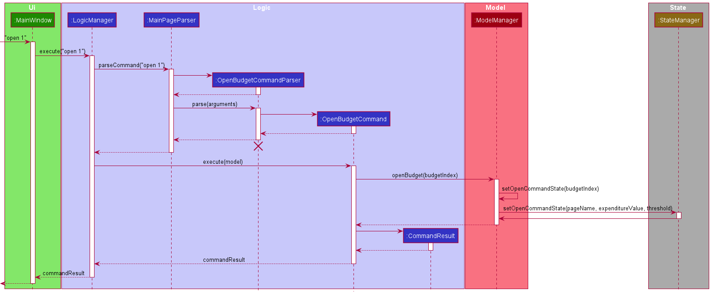
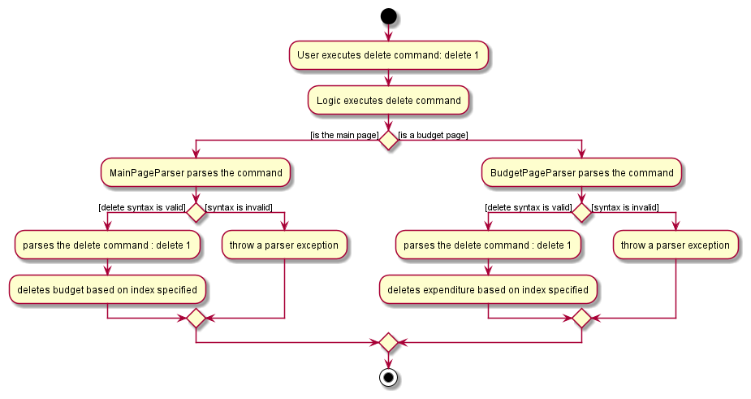

# Chew Song Yu's Project Portfolio Page

## Project: NUSave

NUSave is a desktop budgeting application used to manage an individual's budgets and expenses. NUSave can hold multiple budgets, of which each budget holds multiple expenditures. The user interacts with it using a command line interface (CLI), and it has a GUI created with JavaFX. It is written in Java, and has about 10,000 LoC.

Given below are my contributions to the project:
-  **Feature**: Added a new high-level component (aside of those already available from AB3), **State**, which manages the state of NUSave. It represents what page the application is currently on (Main Page/Budget Page) and stores stateful information based on the current page it is on. 
	- Justification: This feature allows data concerning stateful information to be separated from the rest of the other components, so that the other components can easily access these information as needed. 
	- Highlights: Handling many of the commands in NUSave, especially commands related to expenditures in NUSave (i.e. adding/editing/deleting expenditures) all involve this component, since the GUI of NUSave updates to display the total expenditure of a budget to the user.
-  **Feature**: Setting up of JavaFx components to dynamically update the information displayed to the user. These information includes the threshold of the budget, and the current total expenditure of that budget.
	- Justification: This improves the user experience greatly, as the user can see in real time the new total expenditure of that budget, as he/she adds/deletes/edits the cost of each expenditure.
- **Feature**: Added the ability to open and close pages in NUSave.
	- What it does : It allows the users to be able to open a specific budget using the command line. By doing so, it leads to various components on the Graphical User Interface (GUI) to update with new and stateful information.
	- Justification: This feature improves the application significantly, as the command was implemented in a way such that information that previously existed on one page would be replaced by information pertaining to the new page, allowing the user to view a clean interface that is not overloaded with unnecessary information.
- **Feature**: Added ability to find and list budgets in NUSave.
	- What it does: `find` allows the users to be able to filter specific budgets in NUSave which matches the input search term. `list` allows the users to list all available budgets that are stored in NUSave.
	- Justification: This feature allows the user to be able to quickly filter to only view relevant budgets that he/she is interested in, without having to scroll through their many budgets that they have stored in NUSave.
- **Feature** : Added ability to add expenditures in NUSave.
	- What it does: `add` allows the users to be able to add expenditures, with its tagged name and price into NUSave.
	- Justification: This features allows users to be able to store expenditures in the application, an essential component of NUSave. 

- **Code Contributed**: [RepoSense Link](https://nus-cs2103-ay2021s1.github.io/tp-dashboard/#breakdown=true&search=&sort=groupTitle&sortWithin=title&since=2020-08-14&timeframe=commit&mergegroup=&groupSelect=groupByRepos&checkedFileTypes=docs~functional-code~test-code~other&tabOpen=true&tabType=authorship&tabAuthor=sogggy&tabRepo=AY2021S1-CS2103T-T11-4%2Ftp%5Bmaster%5D&authorshipIsMergeGroup=false&authorshipFileTypes=docs~functional-code~test-code)

- **Project Management**:
	- Created Issues in milestones v1.2, v1.3
	- [PRs reviewed by me](https://github.com/AY2021S1-CS2103T-T11-4/tp/pulls?q=is%3Apr+reviewed-by%3Asogggy)

- **Enhancements to Existing Features**:
	- Updated the GUI's CSS and created JavaFx components: PRs [#49](https://github.com/AY2021S1-CS2103T-T11-4/tp/pull/49),[#69](https://github.com/AY2021S1-CS2103T-T11-4/tp/pull/69), [#91](https://github.com/AY2021S1-CS2103T-T11-4/tp/pull/91)

- **Contributions to Documentation**
	- User Guide:
		- Added documentation for `open`, `add` and `close` commands.
		- Added documentation for Glossary section.
	- Developer Guide:
		- Added preface for section 3, Design.
		- Added description for `Ui` and `State` architectural components.
		- Added implementation details for `State` component.
		- Added implementation details for Dynamic Updating of GUI of NUSave. 

- **Community**:
	- Reported bugs and suggestions for other teams in the class (examples [1](https://github.com/AY2021S1-CS2103T-T12-3/tp/issues/215), [2](https://github.com/AY2021S1-CS2103T-T12-3/tp/issues/219), [3](https://github.com/AY2021S1-CS2103T-T12-3/tp/issues/215), [4](https://github.com/AY2021S1-CS2103T-T12-3/tp/issues/217))

**Contributions to Developer Guide (Extracts)**:

1.1. This section includes an extract of the developer guide, elaborating on dynamic updating of information 
on NUSave's GUI.

##### Sequence Diagram

The following sequence diagram shows the interactions between the `Ui`, `Logic`,`Model` and `State` components of NUSave,
depicting a scenario where the user opens a budget.

Figure 4.4.2.2.1.1. Sequence Diagram for Open Command

1. `MainWindow` is called with the String `open 1`.
2. `MainWindow` uses `LogicManager` to execute the given user input.
1. The `LogicManager` uses the `MainPageParser` to parse the given user input.
2. The `MainPageParser` identifies the command given by the user and creates an `OpenBudgetCommandParser`.
3. The `MainPageParser` passes the user input into the newly created`OpenBudgetCommandParser`.
4. The `OpenBudgetCommandParser` creates a `OpenBudgetCommand` object.
5. The `OpenBudgetCommandParser` returns the `OpenBudgetCommand` object back to `LogicManager`.
6. `LogicManager` calls the `execute` method in the `OpenBudgetCommand` object, with the `Model` as a 
parameter.
7. The `OpenBudgetCommand`'s `execute` method calls the `openBudget` method of the existing 
`Model` object passed in.
8. `ModelManager` calls its own `setOpenCommandState` method, which retrieves relevant data to update `State`.
9. `ModelManager` calls `State`'s `setOpenCommandState` method, updating state data relevant to opening a budget.
10. `State`'s `StringProperty` and `BooleanProperty` attributes are updated, which notifies `InfoBox`
and `Title` to update.

With the above sequence, a budget will successfully be opened, and the `Title` component reflects the name of 
the budget, while the `InfoBox` component reflects the total expenditure and threshold of the budget.
 
 1.2. This section elaborates about what `Ui` in NUSave is about.
 
 
 
 **API**: `Ui.java`
 
 The UI consists of a `MainWindow` that is made up of parts e.g.`CommandBox`, `ResultDisplay`,
 `StatusBarFooter` etc. All these, including the `MainWindow`, inherit from the abstract `UiPart` class.
 
 The `UI` component uses JavaFx UI framework. The layout of these UI parts are defined in matching `.fxml` files that are in the `src/main/resources/view` folder. For example, the layout of the `MainWindow` is specified in `MainWindow.fxml`.
 
 In order to dynamically render data to be displayed to the user, when `setUpGuiComponents()` in `MainWindow` is called, 
 the method `setStateBinders()` sets Observer objects to observe changes in `State`. For a complete explanation,
 refer to [4.4.2. Dynamic Updating](#442-dynamic-updating).
 
 In summary, the `UI` component:
 
 * Executes user commands using the `Logic` component.
 * Listens for changes to `Model` and `State` data so that the UI can be updated with the modified data.
 
1.3. This section provides context on how `State` affects how commands are parsed by parsers in NUSave.

The `Logic` component in NUSave relies on data stored in `State` to decide which parser in NUSave will take
control of the execution of commands.

Figure 4.1.1. Figure of Delete Command Activity Diagram

To elaborate further, using Figure 4.1.1. as a reference, when the user executes a delete command, `delete 1`,
while on the main page:

1. `Logic` executes the command, checking whether the current page is a budget page or main page, depending on the 
current page (represented by `currentPage` attribute in `StateManager`) of NUSave.
2. Since NUSave's is current on `Page.MAIN`, `MainPageParser` takes control of the execution, parsing the command input by the user.
3. If the command syntax is valid, the delete command is parsed.

    3a. If the syntax is invalid, a `ParseException` is thrown.

4. NUSave deletes the budget based on the index specified by the user, i.e. the 1st budget displayed.

**Contributions to User Guide (Extracts)**:

2.1. This section elaborates on how a user can use the add expenditure command in NUSave.

#### 5.3.1. Adding an expenditure: `add`

(Contributed by Song Yu)

Format: `add n/NAME p/PRICE [t/TAG]`

Prefix | Parameters | Requirement | Comments
-------| -----------| ------------| ------
 n/    | NAME       | Required    | Name of the expenditure
 p/    | PRICE      | Required    | Price of the expenditure
 t/    | TAG        | Optional    | Additional information about the expenditure

You can use this command to add a new expenditure with the given `PRICE` and optional `TAG` within a budget.

When you add a new expenditure, it will be displayed as an expenditure card in the list view.
 
✏️ Example: `add n/Graphic Calculator p/199.90 t/Math`

This will add a new expenditure called "Graphic Calculator" with a price of $199.90 and a "Math" tag as seen in 
Figure 5.3.1.1. below:

Figure 5.3.1.1. Example of using the add expenditure command.
~~~~~~~~~~~~