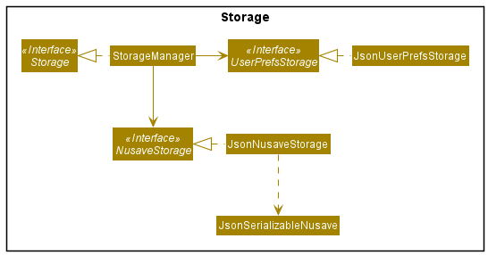
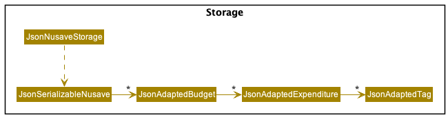
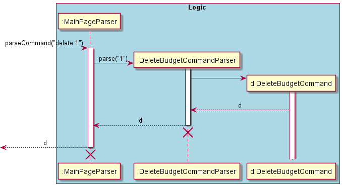
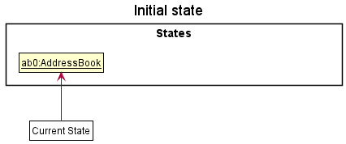
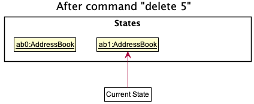
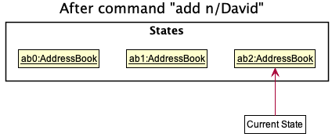
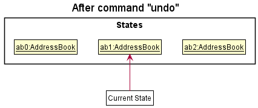
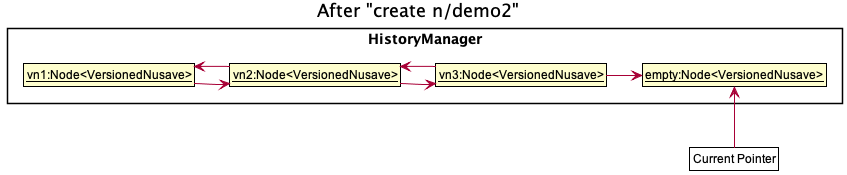
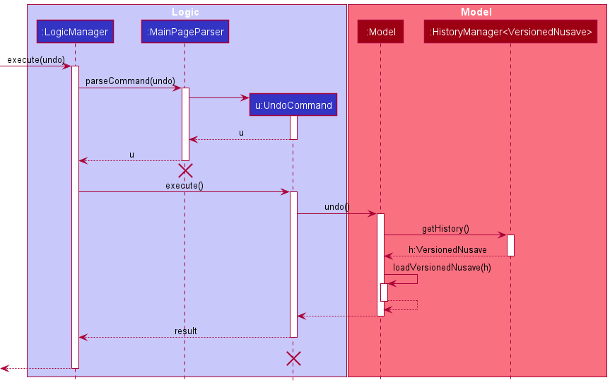

## Project: NUSave

NUSave is a desktop budgeting application used to manage an individual's budgets and expenses. NUSave can hold multiple budgets, of which each budget holds multiple expenditures. The user interacts with it using a command line interface (CLI), and it has a GUI created with JavaFX. It is written in Java, and has about 10,000 LoC.

Given below are my contributions to the project:
-  **Feature**: Added the ability to undo/redo previous commands: PRs [#285](https://github.com/AY2021S1-CS2103T-T11-4/tp/pull/285), [#291](https://github.com/AY2021S1-CS2103T-T11-4/tp/pull/291)
    - What it does: allows the user to undo all previous commands that modifies NUSave data one at a time.
	- Justification: This feature improves user experience significantly as it provides a convenient way for users to rectify their mistakes.
	- Highlights: The implementation was challenging as it required me to come up with my own implementation of a doubly linked list, `Node<T>` and the logic behind `HistoryManager<T>`. As it was the last feature to be implemented, it required in-depth analysis of design alternatives to extent the application without modifying the existing code. Furthermore, I had to come up with a way to remember the current page view to accurately replicate it during when undoing and redoing which resulted in the creation of `VersionedNusave`.
- **Feature**: Added the ability to clear budgets in NUSave: PRs [#127](https://github.com/AY2021S1-CS2103T-T11-4/tp/pull/127)
	- What it does : It allows the users to delete all existing budgets with a single budgets.
	- Justification: This feature improves user experience significantly as it provides a convenient way for users to purge sample data without having to delete them one by one.
-  **Backend**: Changed implementation of storage to store `Budget` and `Expenditure`: PRs [#44](https://github.com/AY2021S1-CS2103T-T11-4/tp/pull/44)
	- Justification: This helped to path the way for other developers to continue working on the application as it enabled them to store and retrieve data.
- **Frontend**: Revamped the GUI's CSS entirely according to Figma mock-up: PRs [#86](https://github.com/AY2021S1-CS2103T-T11-4/tp/pull/86), [#96](https://github.com/AY2021S1-CS2103T-T11-4/tp/pull/96), [#97](https://github.com/AY2021S1-CS2103T-T11-4/tp/pull/98), [#99](https://github.com/AY2021S1-CS2103T-T11-4/tp/pull/99), [#101](https://github.com/AY2021S1-CS2103T-T11-4/tp/pull/101), [#145](https://github.com/AY2021S1-CS2103T-T11-4/tp/pull/145)
	- Justification: This modification improves user experience significantly as it gives the application a fresh look as compared to AB3.

- **Code Contributed**: [RepoSense Link](https://nus-cs2103-ay2021s1.github.io/tp-dashboard/#breakdown=true&search=&sort=groupTitle&sortWithin=title&since=2020-08-14&timeframe=commit&mergegroup=&groupSelect=groupByRepos&checkedFileTypes=docs~functional-code~test-code~other&tabOpen=true&tabType=authorship&tabAuthor=sogggy&tabRepo=AY2021S1-CS2103T-T11-4%2Ftp%5Bmaster%5D&authorshipIsMergeGroup=false&authorshipFileTypes=docs~functional-code~test-code)

- **Project Management**:
    - Setup github organisation and repository
    - Setup continuous integration
    - Managed releases `v0.1, v1.3.trial, v1.3, v1.4`
	- Created issues in milestones v1.2, v1.3
	- [PRs reviewed by me](https://github.com/AY2021S1-CS2103T-T11-4/tp/pulls?q=is%3Apr+reviewed-by%3Asogggy)

- **Enhancements to Existing Features**:
	- Wrote stub generators for `TypicalBudget` and `TypicalExpenditure`: PRs [#137](https://github.com/AY2021S1-CS2103T-T11-4/tp/pull/137)
	- Added optional threshold for `Budget`: PRs [#128](https://github.com/AY2021S1-CS2103T-T11-4/tp/pull/128)
	- Removed all traces of AB3 from code base: PRs [#61](https://github.com/AY2021S1-CS2103T-T11-4/tp/pull/61)

- **Contributions to Documentation**
	- User Guide:
		- Added documentation for the `clear`, `undo` and `redo` commands.
		- Added documentation for Overview, GUI Layout and Quick Start sections**.
	- Developer Guide:
		- Added description for `Storage` architectural component.
		- Added implementation details for Parsers.
		- Added implementation details for Undo & Redo Commands.
		- Added implementation details for List View Rendering.

- **Community**:
	- Reported bugs and suggestions for other teams in the class: PRs [#1](https://github.com/wenhaogoh/ped/issues/1), [#2](https://github.com/wenhaogoh/ped/issues/2), [#3](https://github.com/wenhaogoh/ped/issues/3), [#4](https://github.com/wenhaogoh/ped/issues/4), [#5](https://github.com/wenhaogoh/ped/issues/5), [#6](https://github.com/wenhaogoh/ped/issues/6)

### Contributions to Developer Guide (Extracts)

#### 3.2.5. Storage Component
(Contributed by Wen Hao)

**API** : `Storage.java`

The `Storage` component:
* Can save `UserPref` objects in JSON format and read it back.
* Can save all NUSave data in JSON format and read it back.

Figure 3.6.1: Structure of the storage component.

The `Storage` component uses the Jackson API to convert Plain Old Java Objects (POJOs) into JSON files which are then
stored locally. It uses the same API to read existing JSON files during the launch of the application to load the stored
data into `NUSave`. As seen in Figure 3.6.1, `JsonUserPrefsStorage` is responsible for the reading and writing of
`UserPref` objects and contains the file path of its JSON file while `JsonNusaveStorage` is responsible for the
reading and writing of all NUSave data and contains the file path of its JSON file.

Figure 3.6.2: Structure of the data stored by NUSave.

In order for them to be recognised by the Jackson API, NUSave data objects (such as `Budget` and `Expenditure`) must be
converted into POJOs. Figure 3.6.2 depicts how the respective POJO classes for each of the data objects interact with
one another.

#### 4.2.1. Page Parsers
(Contributed by Wen Hao)

Page parsers are responsible for determining the type of `Command` object that will be generated from a user input.
They enable NUSave to only recognise a set of commands specific to a certain `Page` when the user is on that `Page`.

They implement the `PageParser` interface.

All user inputs are first parsed by a page parser.
It identifies the first word to be the command word and uses it to determine the type of `Command` object that will be generated.
The remaining words are then passed as arguments to the respective command parsers.
A `ParseException` is thrown if the command word is not recognised by the page parser.

There are two types of page parsers:
1. `MainPageParser`
2. `BudgetPageParser`

User inputs are parsed by the `MainPageParser` if they are entered while NUSave is on the main page.
User inputs are parsed by the `BudgetPageParser` if they are entered while NUSave is on a budget page.

More information regarding what page the user is on can be found [here](#41-state).

#### 4.2.2. Command Parsers
(Contributed by Wen Hao)

Command parsers are responsible for generating the different types of `Command` object.

They implement the `Parser<T>` interface.

Arguments in user inputs are parsed by a command parser to generate the respective `Command` object.
The type of `Command` object generated by a command parser follows the generic type of the `Parser<T>` it implements.
For example, `AddExpenditureCommandParser` implements the `Parser<AddExpenditureCommand>` interface. Hence, it will only generate `AddExpenditureCommand` objects.
A `ParseException` is thrown if the necessary arguments to generate the respective `Command` object are invalid or missing.

#### 4.2.3. Interaction Between Parsers

The interaction between the parsers is illustrated by the example usage seen in Figure 4.2.3.1 below:

 

Figure 4.2.3.1. Sequence diagram of a user input being parsed.

#### 4.3.6. Undo & Redo Commands
(Contributed by Wen Hao)

The undo and redo commands are implemented using the following classes:

| Class             | Details            | Purpose |
| -------- | --------------------------- | -------------- |
| `VersionedNusave` | Contains a `BudgetList` and `BudgetIndex` | Represents the data and view of NUSave at a certain point in time |
| `Node<T>`         | Contains a value of type `T`, next `Node<T>` and previous `Node<T>` | Represents a doubly linked list |
| `HistoryManager<T>` | Contains a pointer to a `Node<T>` | Represents an iterator to iterate through a doubly linked list represented by `Node<T>` |

The following class diagram shows how the classes interact with each other:

The pointer in `HistoryManager<VersionedNusave>` is always pointing to the latest `VersionedNusave` in a doubly linked list represented by `Node<T>`. If an undo command is executed, it will load the previous `VersionedNusave` and move the pointer backward. If a redo command is executed, it will load the next `VersionedNusave` and move the pointer forward. Whenever the user makes changes to NUSave data, a `VersionedNusave` is instantiated with a deep copy of the `BudgetList` from `Nusave` and the `BudgetIndex` from `State`. It replaces the next `Node<T>` (if any) of the `Node<T>` that `HistoryManager<VersionedNusave>` is currently pointing to before the pointer is moved forward.

To better illustrate the process, an example usage shown below:

Step 1: The user launches NUSave. `HistoryManager<VersionedNusave>` is instantiated with an empty doubly linked list.

Step 2: The user makes changes to NUSave data by creating a `Budget` named "demo". Before the change is made, a `VersionedNusave` is instantiated in case the user wants to undo. `HistoryManager<VersionedNusave>` adds this `VersionedNusave` to the doubly linked list.

Step 3: The user executes the undo command. Before reverting the changes, a `VersionedNusave` is instantiated in case the user wants to redo. `HistoryManager<VersionedNusave>` adds this `VersionedNusave` to the doubly linked list before moving its pointer backward to retrieve the previous `VersionedNusave`. The `BudgetList` from the previous `VersionedNusave` is loaded into `Nusave` while the `BudgetIndex` from the previous `VersionedNusave` is used to set `State`. Once this is done, the GUI should reflect that the "demo" budget is removed from NUSave.

Step 4: The user executes the redo command. `HistoryManager<VersionedNusave>` retrieves the next `VersionedNusave` from the pointer and moves its pointer forward. The `BudgetList` from the next `VersionedNusave` is loaded into `Nusave` while the `BudgetIndex` from the next `VersionedNusave` is used to set `State`. Once this is done, the GUI should reflect that the "demo" budget is added back to NUSave.

Step 5: The user makes changes to NUSave data by creating a `Budget` named "demo2". Before the change is made, a `VersionedNusave` is instantiated in case the user wants to undo. `HistoryManager<VersionedNusave>` adds this `VersionedNusave` to the doubly linked list before moving its pointer forward.

The following sequence diagram shows how the undo command is executed:

### Contributions to User Guide (Extracts)

## 1. Overview
(Contributed by Wen Hao)

Welcome to the NUSave User Guide! In this section, you will be given an overview of what NUSave is about
and what you can get out of reading this document.

### 1.1. Introduction
(Contributed by Wen Hao)

Are you a **university student who stays on campus** and has difficulty managing your expenses?
Are you tired of having to look through countless spreadsheets and memos just to figure out how much you have spent this month?
Do you wish there exists a desktop application that can help you organise, track and manage all your expenses?

Look no further, NUSave is just the tool for you!

Built by 5 university students staying on campus, we understand **the difficulties of having to manage multiple budgets**,
be it for your daily expenses, school projects or club activities, amidst your busy schedule. NUSave aims to help alleviate
the hassle that comes along with managing multiple budgets by providing a **one-stop solution** to all your problems.

With NUSave, you can **create, edit and delete [budgets](#7-glossary) and [expenditures](#7-glossary)**, as well as **generate statistics
based on your entries** to gain useful insights regarding your spending habits.

What's more, NUSave has:
- a **[Command Line Interface (CLI)](#7-glossary)** catered to those who can type fast and prefer to use a keyboard. In other words, you
navigate the application and execute instructions by keying in text-based commands into the [command box](#3-gui-layout) provided.
- a **[Graphical User Interface (GUI)](#7-glossary)** to provide you with a visually appealing and aesthetic user experience. Essentially,
the current status of the application is reflected live on-screen so what you see is what you get!

### 1.2. Purpose
(Contributed by Wen Hao)

The purpose of this document is to serve as a guide for new users on how to get started with NUSave as well as
to provide a detailed reference for veteran users on how to use the different commands that are available within NUSave.

## 2. About the User Guide

In this section, you will learn what the different symbols and notations (that can be found this in user guide) mean.

## 3. GUI Layout
(Contributed by Wen Hao)

In this section, you will be given an introduction to the layout of NUSave's Graphical User Interface (GUI).
This will help you better understand what each component that you observe on-screen represents.

There are a total of two pages that you can navigate to when using NUSave:
- Main page
- Budget page

### 3.1. Main Page View
(Contributed by Wen Hao)

You will be directed to the main page upon launching NUSave. On this page, you can see the list of
budgets that are currently stored in NUSave.

Here is how the main page should look like:

Figure 3.1.1. Example of the main page view.

Below is a table containing all the components that can be found on the main page accompanied by their respective purposes:

Component      | Purpose
-------------- | -------
Command Box    | A text field for you to enter your desired commands.
Result Display | A **scrollable** panel that displays the response messages of a command after it has been executed.
Info Box       | A panel that displays the current date and time.
Title          | A text field that displays the name of the application.
Budget Card    | A card that represents a budget stored in NUSave. It contains the index and name of the budget as well as the total number of expenditures it contains.
List View      | A **scrollable** panel that can hold multiple budget cards.

Here is the breakdown of an individual budget card:

Figure 3.1.2. Example of a budget card.

Below is a table containing all the components that can be found in a budget card accompanied by their respective purposes:

Component         | Purpose
----------------- | -------
Index             | The index used to reference this budget.
Name              | The name of this budget.
Expenditures Count | The total number of expenditures stored in this budget.

### 3.2. Budget Page View
(Contributed by Wen Hao)

You will be directed to a budget page when you use the [open budget command](#528-opening-a-budget-open).
On this page, you can see the list of expenditures that are currently stored in the budget that you have opened.

Here is how a budget page should look like:

Figure 3.2.1. Example of a budget page view.

Below is a table containing all the components that can be found on a budget page accompanied by their respective purposes:

Component | Purpose
--------- | -------
Command Box | A text field for you to enter your desired commands.
Result Display | A **scrollable** panel that displays the response messages of a command after it has been executed.
Info Box | A panel that displays the total amount you have spent so far based on the expenditures added to the budget. It will also display the threshold of the budget if it has one.
Title | A text field that displays the name of the budget that is currently open.
Expenditure Card | A card that represents an expenditure stored in the budget that is currently open. It contains the index, name, tags and price of the expenditure.
List View | A **scrollable** panel that can hold multiple expenditure cards.

Here is the breakdown of an individual expenditure card:

Figure 3.2.2. Example of an expenditure card.

Below is a table containing all the components that can be found in an expenditure card accompanied by their respective purposes:

Component     | Purpose
------------- | -------
Index         | The index used to reference this expenditure.
Name          | The name of this expenditure.
Creation Date | The date at which this expenditure is added.
Tags          | The tags that this expenditure has been assigned.
Price         | The price of this expenditure.

## 4. Quick Start
(Contributed by Wen Hao)

If this is your first time using NUSave, follow these simple steps to jump straight into the action:

1. Ensure that you have Java `11` or above installed in your computer.

2. Download the latest `NUSave.jar` from [here](https://github.com/AY2021S1-CS2103T-T11-4/tp/releases).

3. Copy the file to the folder you want to use as the *home folder* for NUSave.

4. Double-click the file to start the application. A GUI similar to [Figure 3.1.1](#31-main-page-view) should appear in a few seconds.

> 📕 If the application does not start after double-clicking the file, you can troubleshoot by doing the following:
>
> <ins>For Windows <a href="#7-glossary">OS</a> users:</ins>
> 1. Launch [command prompt](#7-glossary) and navigate to the path of the home folder for NUSave.
> 2. Enter the following command: `java -jar nusave.jar` as seen in Figure 4.1 below:
>
> 
>
> Figure 4.1. Example of launching NUSave using command prompt.
>
> <ins>For Mac OS users:</ins>
> 1. Launch [terminal](#7-glossary) and navigate to the path of the home folder for NUSave.
> 2. Enter the following command: `java -jar nusave.jar` as seen in Figure 4.2 below:
>
> 
>
> Figure 4.2. Example of launching NUSave using terminal.

5. Congratulations, you have successfully launched NUSave!
> 📕 If you are launching the application for the first time, a set of sample data will be created for you.
> Use the [clear command](#527-clearing-budgets-clear) to purge any existing sample data.

6. Type your desired command into the command box and press the enter button to execute it. Below is a series of commands that you can try:
    - `create n/Daily Expenses`: Creates a budget with the name "Daily Expenses".
    - `open 1`: Opens the budget located at index 1.
    - `close`: Closes the budget that is open and return to the main page.
    - `help`: Shows the list of commands currently available.
    - `exit`: Exits the app.

7. Refer to the [commands section](#5-commands) below for the details of each command.
