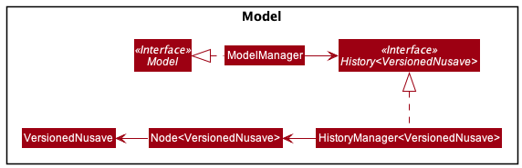

## Project: NUSave

NUSave is a desktop budgeting application used to manage an individual's budgets and expenses. NUSave can hold multiple budgets, of which each budget holds multiple expenditures. The user interacts with it using a command line interface (CLI), and it has a GUI created with JavaFX. It is written in Java, and has about 10,000 LoC.

Given below are my contributions to the project:
-  **Feature**: Added the ability to undo/redo previous commands: PRs [#285](https://github.com/AY2021S1-CS2103T-T11-4/tp/pull/285), [#291](https://github.com/AY2021S1-CS2103T-T11-4/tp/pull/291)
    - What it does: allows the user to undo all previous commands that modifies NUSave data one at a time.
	- Justification: This feature improves user experience significantly as it provides a convenient way for the user to rectify their mistakes.
	- Highlights: The implementation was challenging as it required me to come up with my own implementation of a doubly linked list, `Node<T>`, and its iterator, `HistoryManager<T>`. As it was the last feature to be implemented, it required in-depth analysis of design alternatives to extent the application without modifying existing code. Furthermore, it was a challenge to remember the current page view in addition to the data using `VersionedNusave` so that it can be accurately replicated when undoing and redoing.
- **Feature**: Added the ability to clear budgets in NUSave: PRs [#127](https://github.com/AY2021S1-CS2103T-T11-4/tp/pull/127)
	- What it does : It allows the user to delete all existing budgets with a single budgets.
	- Justification: This feature improves user experience significantly as it provides a convenient way for the user to purge sample data without having to delete them one by one.
-  **Backend**: Changed implementation of storage to store `Budget` and `Expenditure`: PRs [#44](https://github.com/AY2021S1-CS2103T-T11-4/tp/pull/44)
	- Justification: This helped to path the way for the team to continue NUSave's development.
- **Frontend**: Revamped the GUI according to Figma mock-up: PRs [#86](https://github.com/AY2021S1-CS2103T-T11-4/tp/pull/86), [#96](https://github.com/AY2021S1-CS2103T-T11-4/tp/pull/96), [#97](https://github.com/AY2021S1-CS2103T-T11-4/tp/pull/98), [#99](https://github.com/AY2021S1-CS2103T-T11-4/tp/pull/99), [#101](https://github.com/AY2021S1-CS2103T-T11-4/tp/pull/101), [#145](https://github.com/AY2021S1-CS2103T-T11-4/tp/pull/145)
	- Justification: This modification improves user experience significantly as it gives the application a fresh look as compared to AB3.

- **Code Contributed**: [RepoSense Link](https://nus-cs2103-ay2021s1.github.io/tp-dashboard/#breakdown=true&search=&sort=groupTitle&sortWithin=title&since=2020-08-14&timeframe=commit&mergegroup=&groupSelect=groupByRepos&checkedFileTypes=docs~functional-code~test-code~other&tabOpen=true&tabType=authorship&tabAuthor=sogggy&tabRepo=AY2021S1-CS2103T-T11-4%2Ftp%5Bmaster%5D&authorshipIsMergeGroup=false&authorshipFileTypes=docs~functional-code~test-code)

- **Project Management**:
    - Responsible for overall project coordination and work delegation
    - Setup github organisation and repository
    - Setup continuous integration
    - Managed releases `v0.1, v1.3.trial, v1.3, v1.4`
	- Created issues in milestones v1.2, v1.3
	- [PRs reviewed by me](https://github.com/AY2021S1-CS2103T-T11-4/tp/pulls?q=is%3Apr+reviewed-by%3Awenhaogoh)

- **Enhancements to Existing Features**:
	- Wrote stub generators for `TypicalBudget` and `TypicalExpenditure`: PRs [#137](https://github.com/AY2021S1-CS2103T-T11-4/tp/pull/137)
	- Added optional threshold for `Budget`: PRs [#128](https://github.com/AY2021S1-CS2103T-T11-4/tp/pull/128)
	- Removed all traces of AB3 from code base: PRs [#61](https://github.com/AY2021S1-CS2103T-T11-4/tp/pull/61)

- **Contributions to Documentation**
	- User Guide:
		- Added documentation for the `clear`, `undo` and `redo` commands
		- Added documentation for Overview, GUI Layout and Quick Start sections**
	- Developer Guide:
		- Added description for `Storage` architectural component
		- Added implementation details for Parsers
		- Added implementation details for Undo & Redo Commands
		- Added implementation details for List View Rendering

- **Community**:
	- Reported bugs and suggestions for other teams in the class: PRs [#1](https://github.com/wenhaogoh/ped/issues/1), [#2](https://github.com/wenhaogoh/ped/issues/2), [#3](https://github.com/wenhaogoh/ped/issues/3), [#4](https://github.com/wenhaogoh/ped/issues/4), [#5](https://github.com/wenhaogoh/ped/issues/5), [#6](https://github.com/wenhaogoh/ped/issues/6)

 
 
 
 
 
 

### Contributions to Developer Guide (Extracts)

Below is an extract of my contributions to the developer guide:

#### 4.3.6. Undo & redo commands
(Contributed by Wen Hao)

This section elaborates on the events of the undo and redo commands.

The undo and redo commands are implemented using the following classes:

| Class             | Details            | Purpose |
| -------- | --------------------------- | -------------- |
| `VersionedNusave` | Contains a `BudgetList` and `BudgetIndex` | Represents the data and view of NUSave at a certain point in time |
| `Node<T>`         | Contains a value of type `T`, next `Node<T>` and previous `Node<T>` | Represents a doubly linked list |
| `HistoryManager<T>` | Contains a pointer to a `Node<T>` | Represents an iterator to iterate through a doubly linked list represented by `Node<T>` |

The following class diagram shows how the classes interact with each other:

Figure 4.3.6.1. Class diagram of the classes related to undo and redo command.

### Contributions to User Guide (Extracts)

Below is an extract of my contributions to the user guide:

## 3. GUI Layout
(Contributed by Wen Hao)

In this section, you will be given an introduction to the layout of NUSave's Graphical User Interface (GUI).
This will help you better understand what each component that you observe on-screen represents.

There are a total of two pages that you can navigate to when using NUSave:
- Main page
- Budget page

### 3.1. Main Page View
(Contributed by Wen Hao)

You will be directed to the main page upon launching NUSave. On this page, you can see the list of
budgets that are currently stored in NUSave.

Here is how the main page should look like:

Figure 3.1.1. Example of the main page view.

Below is a table containing all the components that can be found on the main page accompanied by their respective purposes:

Component      | Purpose
-------------- | -------
Command Box    | A text field for you to enter your desired commands.
Result Display | A **scrollable** panel that displays the response messages of a command after it has been executed.
Info Box       | A panel that displays the current date and time.
Title          | A text field that displays the name of the application.
Budget Card    | A card that represents a budget stored in NUSave. It contains the index and name of the budget as well as the total number of expenditures it contains.
List View      | A **scrollable** panel that can hold multiple budget cards.

Here is the breakdown of an individual budget card:

Figure 3.1.2. Example of a budget card.

Below is a table containing all the components that can be found in a budget card accompanied by their respective purposes:

Component         | Purpose
----------------- | -------
Index             | The index used to reference this budget.
Name              | The name of this budget.
Expenditures Count | The total number of expenditures stored in this budget.
