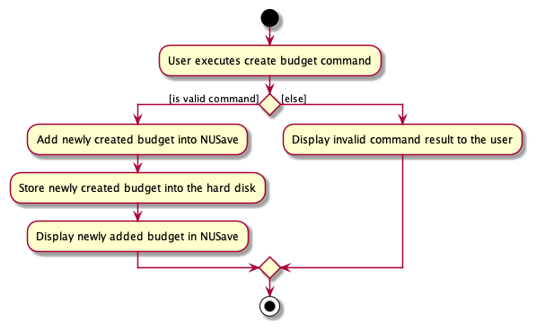
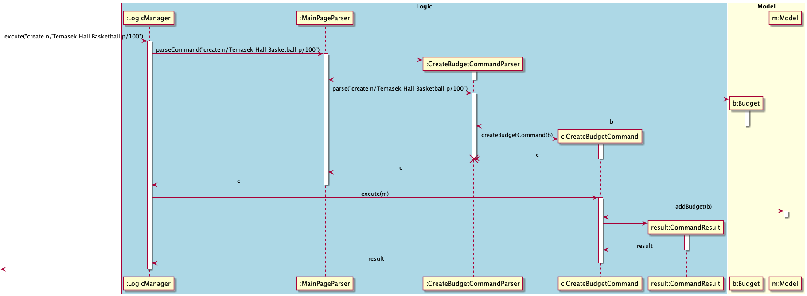

## Project: NUSave

NUSave is a desktop budgeting application used to manage an individual's budgets and expenses. NUSave can hold multiple
budgets, of which each budget holds multiple expenditures. The user interacts with it using a command line interface
(CLI), and it has a GUI created with JavaFX. It is written in Java, and has about 10,000 LoC.

Given below are my contributions to the project:
- **Feature** : Added ability to create a budget in NUSave.
	- What it does: `create` allows the users to create budget with its name and threshold value into NUSave.
	- Justification: This feature allows users to create and store budgets in the application,
	an essential component of NUSave.
- **Feature** : Added ability to edit budget in NUSave.
	- What it does: `edit` allows the users to edit a budget’s name and threshold value in NUSave.
	- Justification: This feature allows users to edit a specific budget’s name and threshold value in the application,
	an essential component of NUSave.
- **Feature** : Added ability to view help in NUSave.
	- What it does: `help` allows the users to view the help commands in NUSave.
	- Justification: This feature allows users to view all command help instructions in NUSave.
	- Highlight: This feature displays a different set of help instructions depending on which page the user is on.
	For example, if the user is on the main page, it will display unique command to the main page,
	such as open a budget and create a budget command.
- **Feature** : Added ability to sort budgets in NUSave.
	- What it does: `sort` allows the users to be able to sort budgets in NUSave.
	- Justification: This feature allows users to sort all budgets in NUSave either by their name in alphabetical order,
	or their created date with the latest on top.
- **Feature** : Added ability to sort expenditures in NUSave.
	- What it does: `sort` allows the users to be able to sort expenditures in NUSave.
	- Justification: This feature allows users to sort all expenditures in a budget either by their name in alphabetical order,
	or their created date with the latest on top.
	- Highlight: The implementation can be challenging as I need to implement different Comparator for the sort command
	while abiding by the OO principle.
- **Feature** : Added ability dynamically to view the current date and time in NUSave.
	- What it does: Dynamically updating the date and time in the main page view, info box UI component of NUSave.
	- Justification: This feature allows users to track the current date and time while managing their budgets.
	- Highlight: This enhancement affects the UI component of NUSave by rendering the current date and time.
	It also generates a unique greeting message depending on the time of the day.
	The implementation too was challenging as it required the understanding of the Java Thread class.
- **Code Contributed**: [RepoSense Link](https://nus-cs2103-ay2021s1.github.io/tp-dashboard/#breakdown=true&search=&sort=groupTitle&sortWithin=title&since=2020-08-14&timeframe=commit&mergegroup=&groupSelect=groupByRepos&checkedFileTypes=docs~functional-code~test-code~other&tabOpen=true&tabType=authorship&tabAuthor=yu-ming-chen&tabRepo=AY2021S1-CS2103T-T11-4%2Ftp%5Bmaster%5D&authorshipIsMergeGroup=false&authorshipFileTypes=docs~functional-code~test-code~other)
- **Project Management**:
	- Created Issues in milestones v1.2, v1.3
	- [PRs reviewed by me](https://github.com/AY2021S1-CS2103T-T11-4/tp/pulls?q=is%3Apr+reviewed-by%3Ayu-ming-chen)
- **Enhancements to Existing Features**:
	- Added the ability for `edit` expenditure to edit expenditure tags: PR [#272](https://github.com/AY2021S1-CS2103T-T11-4/tp/pull/272)
	    - What it does: `edit` expenditure tags allows the users to be able to edit tags on expenditure in NUSave. 
    	- Justification: This feature allows users to replace and change tags on specific expenditures in a budget,
    	an essential component of NUSave.
    - Added NUSave icon to application UI interface: PR [#267](https://github.com/AY2021S1-CS2103T-T11-4/tp/pull/267)
- **Contributions to Documentation**
	- User Guide:
		- Added documentation for `Symbols`, `Syntax format` and `Command summary` section.
		- Added documentation for the features `help`, `create` budget, `edit` budget, `sort` budget and `sort`
		expenditures.
		- Did cosmetic tweaks to existing documentation by including emoji for annotation.
		- Created and annotated all NUSave screenshots. PR [#212](https://github.com/AY2021S1-CS2103T-T11-4/tp/pull/212)
	- Developer Guide:
		- Added documentation for `Setting up` and `Logic component` in Design Architecture
		- Added implementation details for `Create Budget`, `Edit Budget`, `Sort` and `Help` command with their
		respective sequence diagram and activity diagram.
- **Community**:
	- Reported bugs and suggestions for another team (T09-2) in the class during PE dry run (examples [T09-2 issues 116-141](https://github.com/yu-ming-chen/ped/issues)
- **Tools**:
  * Created UI mockup for our application using Figma [#21](https://github.com/AY2021S1-CS2103T-T11-4/tp/pull/21)
  
-------
- **Contributions to Developer Guide (Extracts)**:
#### 3.2.2. Logic Component
(Contributed by Yu Ming)

**API**: `Logic.java`

`Logic` uses the `MainPageParser` and `BudgetPageParser` class to parse the user command. This results in a
`Command` object which is executed by the `LogicManager`. The command execution can affect the `Model`
(e.g. adding an expenditure). The result of the command execution is encapsulated as a `CommandResult` object
which is passed back to the `Ui`. In addition, the `CommandResult` object can also instruct the `Ui` to perform
certain actions, such as displaying help to the user.

##### 4.3.1.1. Create Budget
(Contributed by Yu Ming)

This section explains the `Create Budget Command`.

The following activity diagram to shows the events that occur when the user executes the Create Budget Command.

 

Figure 4.3.1.1: Activity diagram for create budget command.

The following command occurs in the `Main Page` of NUSave, and results in the specified budget being created in
NUSave. This command therefore requires a compulsory name to specify the name of the budget to be created.

The following Sequence Diagram shows the interaction between the `Logic` component and `Model` component of NUSave 
depicting a scenario when the user wants to create a budget for his Temasek Hall basketball CCA by entering the command
`create n/Temasek Hall Basketball p/100`.

 

Figure 4.3.1.2: Sequence diagram for create budget command in main page view.
>Lifelines with a destroy marker (X) should end at the destroy marker (X) but due to a limitation of PlantUML, 
the lifeline reaches the end of diagram.

1. The `LogicManager` uses the `MainPageParser` to parse the given user input.
2. The `MainPageParser` will identify the command given by the user and pass the user input down to the
`CreateBudgetCommandParser`.
3. The `CreateBudgetCommandParser` will create a `Budget` with the given parameters **name** and **threshold** from the
user input.
4. The `CreateBudgetCommandParser` will then create a `CreateBudgetCommand` object with the created `Budget` object as
the input parameter.
5. The `CreateBudgetCommandParser` will then return a `CreateBudgetCommand` object.
6. `LogicManager` will now call the `execute` method in the `CreateBudgetCommand` object.
7. The `CreateBudgetCommand` will now call the `addBudget` method of the existing `Model` object and add the `Budget`
object created into NUSave.
8. The `CreateBudgetCommand` then returns a `CommandResult` indicating the successful addition of the `Budget` object.

With the above sequence, a budget will be successfully created by the user in his NUSave application, and it will be
reflected on the user interface.

-------
- **Contributions to User Guide (Extracts)**:
#### 5.2.1. Creating a budget: `create`
(Contributed by Yu Ming)

Format: `create n/NAME [p/THRESHOLD]`

Prefix | Parameters | Requirement | Comments
------ | ---------- | ----------- | --------
 n/    | `NAME`     | Required    | Name of the budget
 p/    | `THRESHOLD`| Optional    | Target threshold of the budget

You can use this command to create a new budget with the given `NAME` and `THRESHOLD`.

When you create a new budget, it will be displayed as a budget card in the list view.

✏️ Example: `create n/Temasek Hall Student Council p/1200`

This will create a new budget called "Temasek Hall Student Council" with a threshold value of $1200
as seen in Figure 5.2.1.1 below:

Figure 5.2.1.1. Example of using the create budget command.

-------
